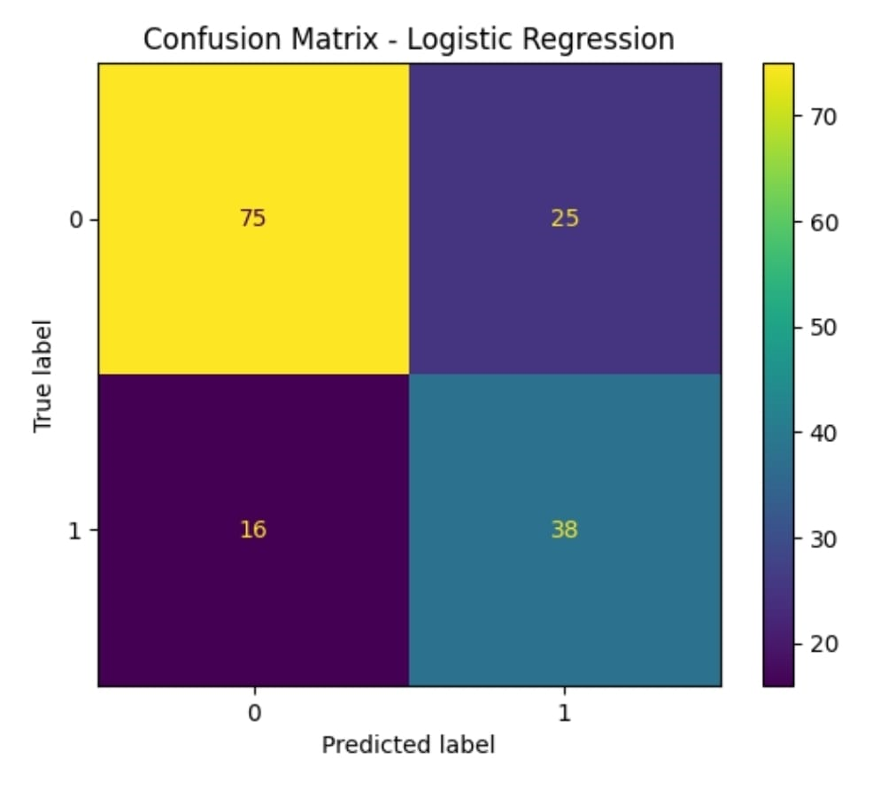

# Diabetes Prediction Using Machine Learning
# Project Overview
This project predicts diabetes risk using medical attributes. Logistic Regression and Balanced Logistic Regression were implemented to handle class imbalance.
# Dataset
- Pima Indians Diabetes Dataset
- 768 records
- 8 features
- Target: Diabetes (0=No, 1=Yes)
# Steps Performed
- Data Cleaning
- Missing Value Handling
- Feature Regression
- Balanced Logistic Regression
- ROC-AUC Analysis
# Results
- Best Model: Balanced Logistic Regression
- Accuracy: 77.9%
- ROC-AUC Score: 81.3%
# Key  Insight
Glucose level is the strongest predictor of diabetes.
# Logistic Regression (Balanced)
- Accuracy: 77.9%
- Precision (Class 1): 0.72
- Recall (Class 1): 0.61
- F1-Score (Class 1): 0.66
 # Random Forest
- Accuracy: ~74%
- Better handling of non-linear patterns
- Slightly lower performance compared to Logistic Regression in this dataset
# Final Conclusion
Logistic Regression with class balancing performed better than Random Forest in terms of overall accuracy and F1-score.

Since this is a medical dataset, recall for diabetic patients (Class 1) is important. Further turning can improve performance.
## Confusion Matrix

